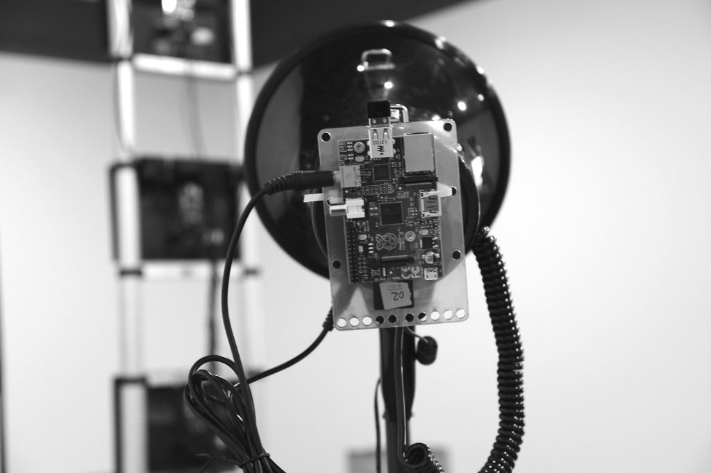

# Manchete
## Manchete
### Manchete

---
### Texto
**bold** *italics* ***bold italics*** ~~riscado~~ <u>grifado</u>

Uma linha em branco começa um novo parágrafo.

Dois espaços no final de uma linha,  
pula para a próxima linha, mas no mesmo parágrafo.

---
#### Link
[Texto do Link](http://olf.space){:target="_blank"}  

---
### Imagem

---
### Video

  <iframe src="https://player.vimeo.com/video/165527282?byline=0&amp;portrait=0" frameborder="0" allowfullscreen="allowfullscreen"></iframe>

---
### Galeria de Foto
Colocar "`swipebox: AL0`" no cabeçalho do post para criar uma galeria com todas as fotos que começam com `AL0`.
